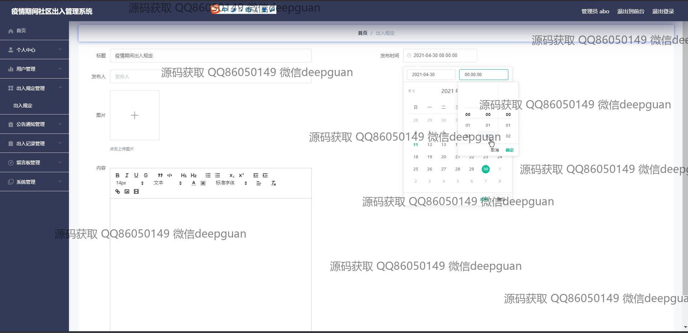

<h1 align="center">疫情期间社区出入管理系统的设计与实现+vue</h1>

## 简介
疫情期间社区出入管理系统：角色分为管理员、用户；包含出入管理、公告管理、留言反馈、出入记录、个人中心等功能，提升社区防疫管理效率。    --计算机毕业设计源码；毕设源码；java毕业设计源码

## 联系方式

<h3 align="center">获取完整代码与数据库文件 + 微信：deepguan QQ: 86050149 QQ群: 783742310</h3>

<h3 align="center">可帮忙远程部署 包运行成功！提供远程部署、修改代码、设计文档指导、代码讲解等服务！</h3>

## 功能介绍（完整见运行截图）
管理员：管理员可以通过导航菜单访问个人中心、用户管理、出入管理、公告管理、系统管理等模块，实现居民信息的增删改查、审批出入申请、管理公告发布、及回复用户留言等操作。用户能够查看个人的出入记录和系统通知，了解公告内容，并在留言板中与管理员交流。用户注册需要提供账户、密码及个人基本信息，系统通过上传功能允许用户编辑和发布新闻、公告及上传图片等信息，确保社区在疫情期间的出入数据管理和信息发布高效。

用户：用户可通过注册登录后访问个人中心管理自己的基本信息，查看和申请出入申请，了解出入规范和公告通知。用户可以在留言板输入反馈和问题，并能看到管理员回复，用户通过系统上传图片与编辑功能，查看并管理自己的出入记录。用户注册界面提供基本信息填写的功能，帮助社区记录个人出入情况，进入系统后用户可以浏览公告、新闻资讯，充分利用系统提供的各类資訊与交流功能。此外用户可以随时退出帐户保障信息安全。

## 运行截图

本代码来源于网络,仅供学习参考使用!

